## 
 <b> Modul 5 Fault Tolerance </b> 

 Nama: Aditya Wisnu Naraya
 Nim: 235410069
 Kelas: Informatika-2

4.1 Load Balancing Aplikasi  
---------------
Materi ini merupakan materi Praktikum SIstem Terdistribusi dan Terdesentralisasi
untuk pembahasan tentang Fault Tolerance. Pembahasan tentang load balancing diperlukan
agar high-availability dari suatu aplikasi bisa tercapai dengan melakukan proses scaling
aplikasi menjadi lebih dari satu dan mengkonfigurasi proxy load balancer.

1. Persiapan  
    Pada materi ini, aplikasi merupakan aplikasi ASGI Python yang dibuat dengan
    menggunakan framework Blacksheep (https://www.neoteroi.dev/blacksheep/). Aplikasi
    dibuat hanya merupakan aplikasi default - tutorial dan hanya digunakan untuk keperluan
    pemahaman load balancing sehingga pembaca perlu melihat pada dokumentasi dari
    Blacksheep jika ingin mendalami pengembangan aplikasi menggunakan framework
    tersebut.
    Software yang diperlukan untuk mengikuti permbahasan ini adalah Docker (jika
    menggunakan Windows, install Docker Desktop
    (https://docs.docker.com/desktop/setup/install/windows-install/). Jika menggunakan Linux,
    install Docker dan Docker Compose menggunakan package manager masing-masing distro.
    Sebagai contoh, berikut ini instalasi pada distro Artix Linux:
    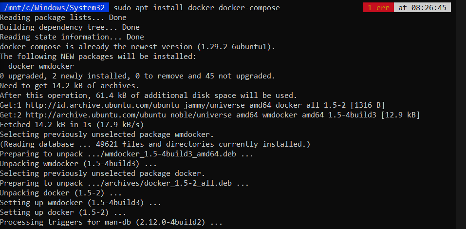  
    Perhatikan, karena aplikasi akan dibuat menggunakan Python, sebaiknya menggunakan env
    manager seperti Micromamba
    (https://mamba.readthedocs.io/en/latest/installation/micromamba-installation.html), uv
    (https://docs.astral.sh/uv/), atau Miniconda
    (https://www.anaconda.com/docs/getting-started/miniconda/install). Silakan dipelajari terlebih
    dahulu dan buat env khusus untuk pembahasan ini. Khusus jika menggunakan uv, gunakan
    panduan berikut: https://github.com/NEO-X-School/notes/blob/main/uv/00.md
    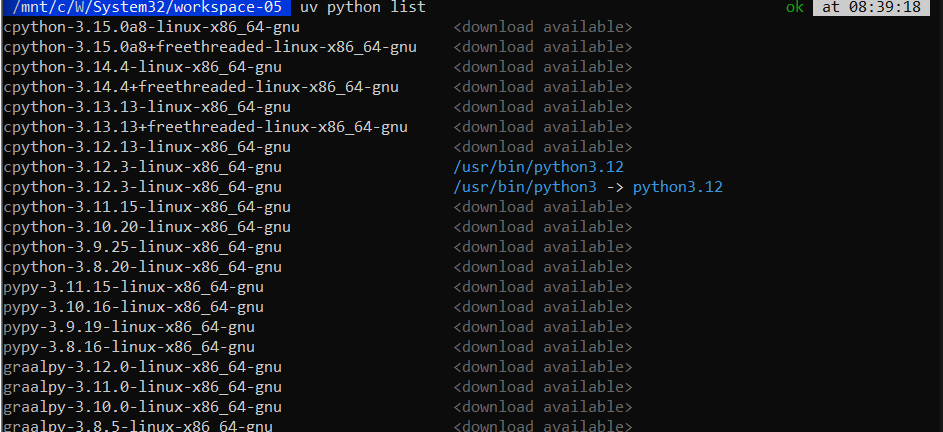
    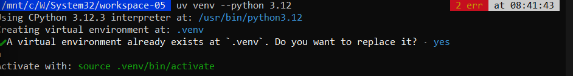  
     Untuk membuat aplikasi web menggunakan Blacksheep, install blacksheep dan
    blacksheep-cli terlebih dahulu:
    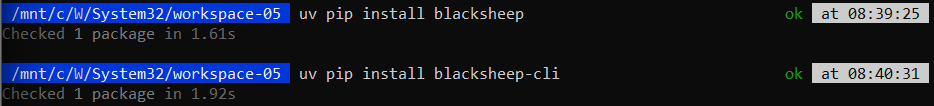 
    sebelumnya sudah di install jadi tampilannya berbeda  

02. Pembuatan Aplikasi Web  
    Setelah itu, buat aplikasi menggunakan cli
    <pre> blacksheep create </pre>
    hasil nya ketika di cek  
    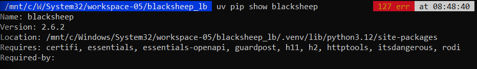  
     install paket yang diperlukan:  
    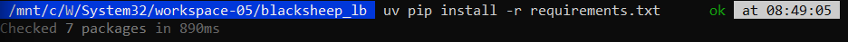  
    ketika sudah di intall akan seperti itu tampilannya  
      Pada shell tempat kita mengaktifkan server, muncul:
    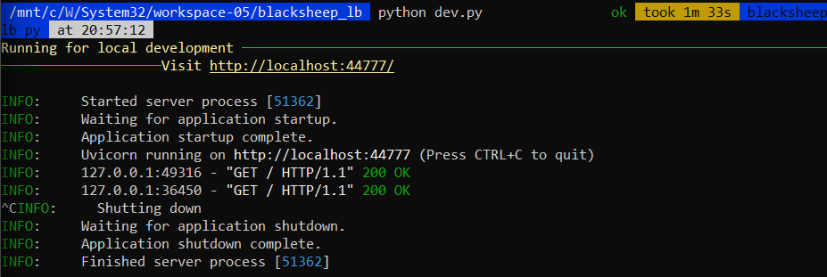  
      Pada titik ini, kita sudah berhasil membuat aplikasi menggunakan Blacksheep. Perhatikan,
    dalam direktori blacksheep_lb sudah ada Dockerfile yang bisa kita gunakan.
    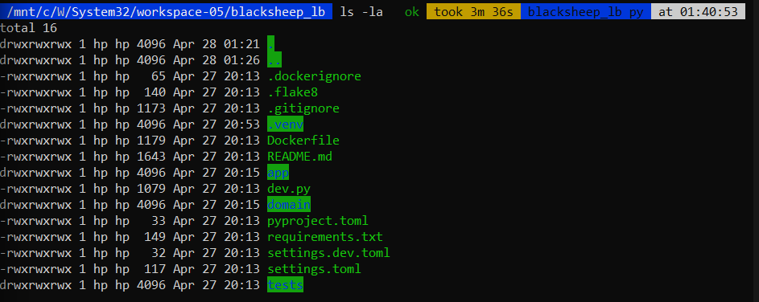  
    Dockerfile ini bisa digunakan dan secara default akan membuka port 80, bukan 44777.
    Ini penting untuk diperhatikan karena akses ke port akan diperlukan saat menggunakan
    Docker Compose.

03. Siapkan Dockerfile dan docker-compose.yml
Ada 2 komponen utama pada materi ini:
    1. Aplikasi yang dibangun menggunakan Blacksheep. Aplikasi ini akan di-scale menjadi
    2 instances.
    2. Proxy untuk load balancing menggunakan nginx.
    Dengan demikian, diperlukan pengaturan sebagai berikut:
    1. Aplikasi diletakkan pada direktori tertentu (blacksheep_lb)
    2. Direktori nginx untuk mengelola load balancer menggunakan nginx
    3. File docker-compose.yml untuk mengelola Docker Compose.
    4. Opsional: env.sh untuk alias - mempermudah pengetikan perintah melalui cli (hanya
    untuk Linux - Bash).
    Aplikasi sudah harus mempunyai Dockerfile, demikian juga nginx.  
    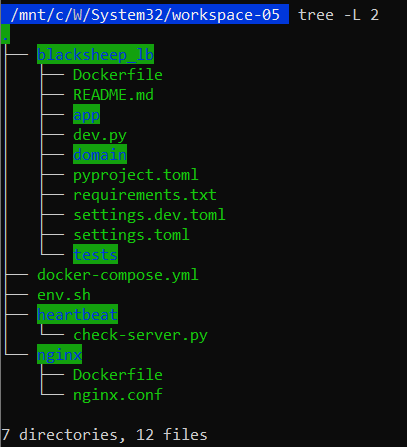  
     blacksheep_lb/Dockerfile
    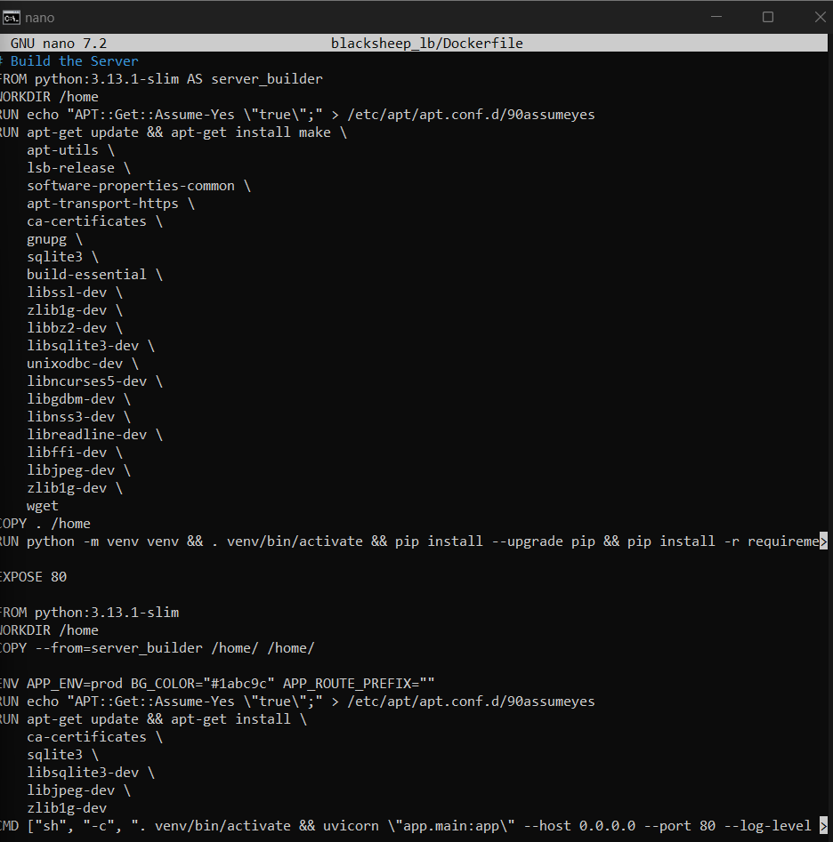  
    Dockerfile di blacksheep_lb ini merupakan bawaan dari Blacksheep. Sila mengedit tetapi
    pastikan bahwa anda memahami cara kerja Docker dan sistem operasi yang akan menjadi
    dasar dari container tersebut. Untuk Dockerfile di atas, perubahan hanya dilakukan untuk
    versi Python yang digunakan yaitu versi 3.13.1-slim.  
     nginx/Dockerfile
    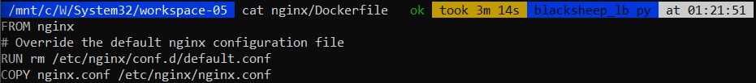  
     nginx/nginx.conf  
    Kita juga perlu menyiapkan konfigurasi nginx sebagai load balancer.
    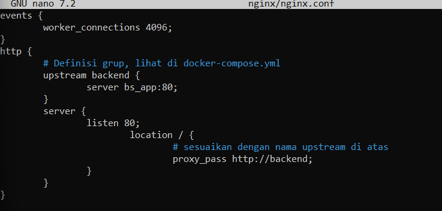  
     docker-compose.yml
    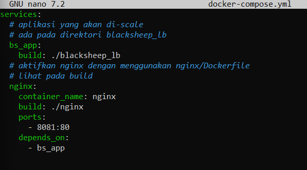  
     env.sh  
    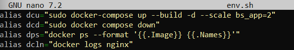  
     Sebelum menjalankan Docker, jalankan dulu service dockerd. Pada sistem yang menggunakan dinit:  
    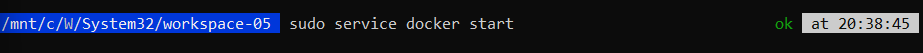   
    Jika menggunakan Linux lainnya, khususnya Linux dengan Systemd, gunakan  
    *sudo systemctl start dockerd*  
   

4. Jalankan Docker Compose  

    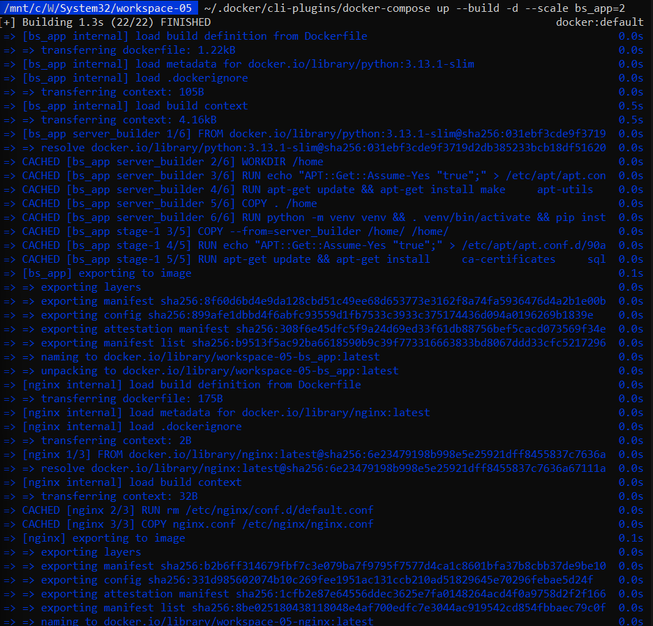  
    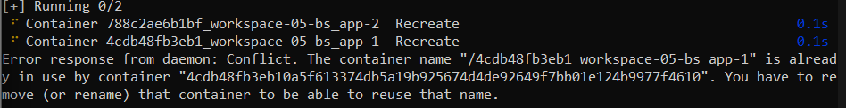  
     Untuk memeriksa, kita bisa melihat hasil di browser:
    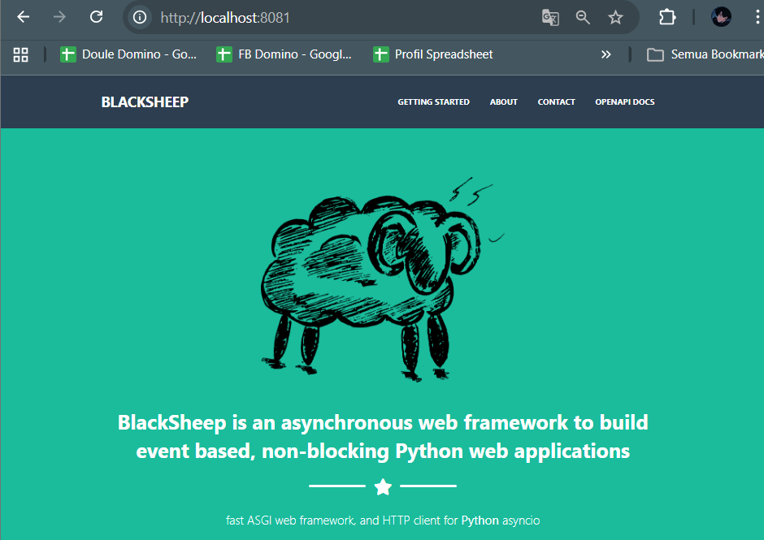  
     Perhatikan: port yang digunakan sekarang port 8081 (jika tidak menyebutkan port seperti
    tamilan di atas - hanya localhost, maka defaultnya 8081), bukan 44777 lagi.  
     Hasil dari docker ps menunjukkan nama aplikasi yang sedang berjalan. Pada bagian ini
    kita bisa melihat ada 2 instances dari aplikasi bs_app yaitu: load-balancing-bs_app-1
    dan load-balancing-bs_app-2 (nama di depan - load-balancing… merupakan hasil
    dari nama direktori).  
    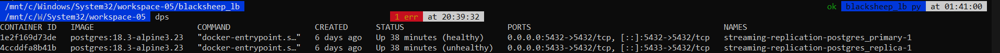  
     Bagaimana mengetahui bahwa load balancing sudah berjalan? Akses ke aplikasi akan
    di-route melalui load balancer (nginx) ke salah satu instance. Lihat potongan log berikut:  
    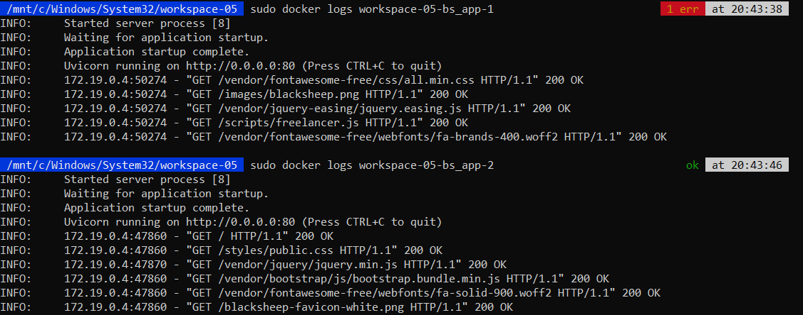  
    Perhatikan: log untuk load-balancing-bs_app-1 mendapatkan 2 akses di bagian
    paling bawah, sementara load-balancing-bs_app-2 tmendapatkan 1 akses di bagian
    paling bawah. Ini berarti pada saat terdapat request, nginx me-route permintaaan / request
    tersebut ke load-balancing-bs_app-1.  
     Jika sudah selesai, matikan semua container:  
    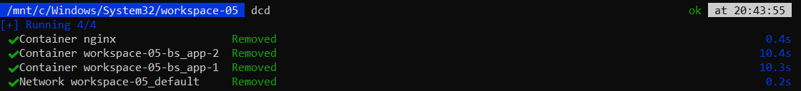 

4. Failure Detection   
     Failure Detection adalah proses untuk menentukan apakah suatu komponen telah gagal.  
    Heartbeat  
      Protokol heartbeat adalah protokol untuk memantau aktivitas suatu komponen. Jika
    suatu komponen pemantauan tidak menerima heartbeat dari komponen lain dalam jangka
    waktu tertentu, komponen tersebut diasumsikan telah gagal dan tidak responsif.  
      heartbeat/check-server.py  
      Cobalah script pada kondisi tidak ada aplikasi blacksheep di port 44777 yang aktif. Setelah
    itu, aktifkan port 44777 untuk aplikasi blacksheep. Jalankan script pada 2 kondisi tersebut
    dan catat serta jelaskan perbedaannya.
    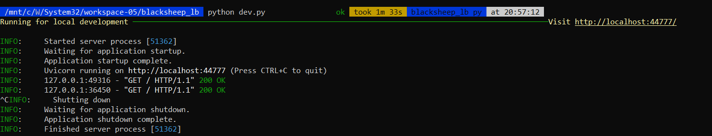  
    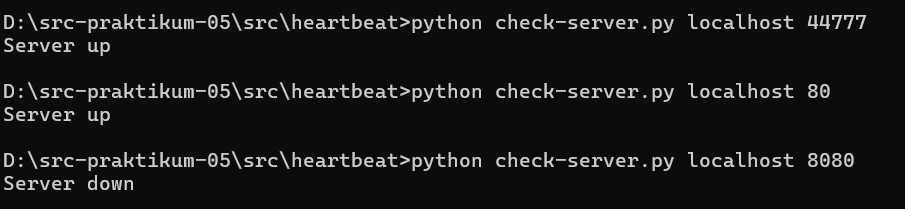  
      failure-detection/
    Library tenacity (https://github.com/jd/tenacity) bisa digunakan untuk mengelola
    proses yang memerlukan keterkaitan dengan komponen di luar aplikasi. Hal ini diperlukan.
    karena selalu ada kemungkinan kegagalan untuk koneksi dengan komponen di luar aplikasi.
    Gunakan file check-retry.py pada 2 kondisi: aplikasi blacksheep aktif dan non-aktif kemudian
    jelaskan.
    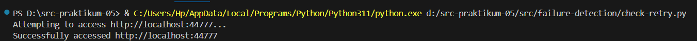  
     Pola circuit breaker merupakan pola desain yang digunakan dalam microservices
    untuk mencegah kegagalan berantai dengan memblokir sementara panggilan ke layanan
    yang gagal. Pola ini bertindak seperti state machine dengan tiga status: "closed", "open",
    dan "half-open".
    Dalam status closed, permintaan diijinkan dan dipantau untuk kegagalan. Jika
    ambang batas kegagalan terpenuhi, circuit breaker beralih ke status open, segera menolak
    permintaan selanjutnya dan memberi layanan waktu untuk pulih. Setelah batas waktu, circuit
    breaker memasuki status half-open, memungkinkan sejumlah permintaan terbatas untuk
    menguji apakah layanan telah pulih. Jika permintaan pengujian berhasil, sirkuit kembali ke
    status "closed"; jika gagal, pemutus sirkuit kembali ke status "topen"  
     Coba script check-circuit-breaker.py pada 2 kondisi: aplikasi blacksheep aktif dan non-aktif
    setelah itu jelaskan cara kerja dari check-circuit-breaker.py.
    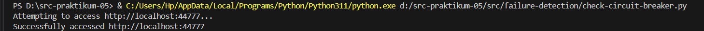 
