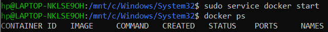
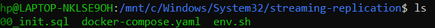
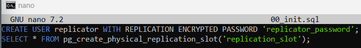
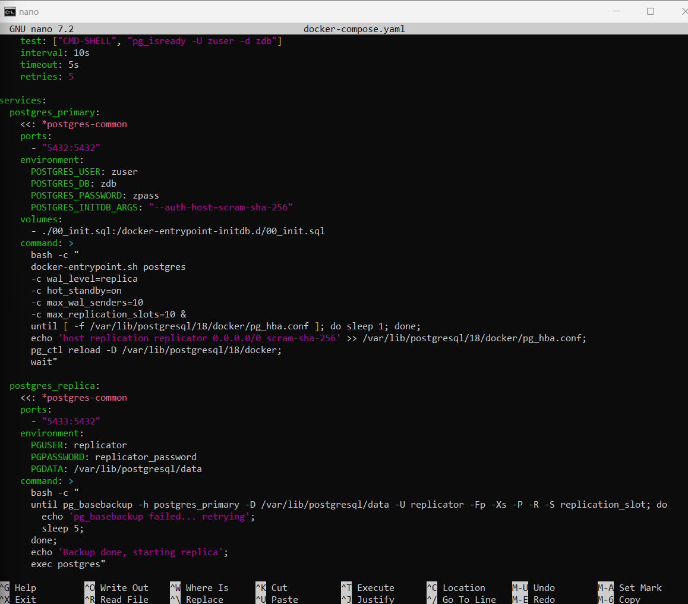
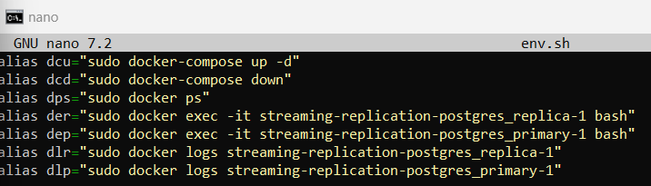

4.1.1 Prasyarat
1. Instalasi Docker telah dilaksanakan. Lihat ke https://.docs.docker.com/engine/install/
jika belum.
2. Instalasi Docker Compose telah dilaksanakan. Lihat ke
https://docs.docker.com/compose/install/ jika belum.
3. Daemon dockerd telah diaktifkan. dengan sudo sudo service docker start

4.1.2 Struktur Direktori dan FIle
File yang diperlukan adalah sebagai berikut:
 

Berikut adalah penjelasan dari masing-masing file tersebut:
1. 00_init.sql: file yang berisi perintah-perintah SQL yang akan dijalankan saat
primary server diinisialisasi dan dijalankan. Fungsi utamanya adalah untuk membuat
user yang akan melakukan replikasi ke primary server serta slot replikasinya.
2. docker-compose.yaml: file konfigurasi yang akan dijalankan oleh
docker-compose.
3. env.sh: file yang berisi berbagai definisi alias di shell (Bash), hanya untuk
memudahkan shortcut penulisan perintah, opsional. Perhatikan bahwa letak nama
direktori nantinya akan menjadi nama depan dari container. Misal, jika semua file-file
disimpan pada direktori src, maka nama container akan menjadi

00_init.sql

docker-compose.yaml

env.sh

Catatan:
● docker-compose up: digunakan untuk mengaktifkan image yang terdiri atas lebih
dari 1 dengan menggunakan konfigurasi docker-compose.yaml
● docker-compose down: digunakan untuk menonaktifkan image yang terdiri atas
lebih dari 1 dengan menggunakan konfigurasi docker-compose.yaml
● docker ps: digunakan untuk melihat daftar container.
● docker exec: digunakan untuk menjalankan proses tertentu )dalam hal ini adalah
bash di container yang sedang berjalan.
● docker logs: digunakan untuk menampilkan log dari container yang sedang berjalan
/ sudah berhenti.

4.1.3 Menjalankan docker-compose
Catatan: command yang dituliskan di sini memanfaatkan alias yang telah didefinisikan di file
a6
a6a

Jika image PostgreSQL 18 pada OS Alpine Linux (postgres:18.3-alpine3.23 -
https://hub.docker.com/_/postgres) belum di-pull (diambil) dari DockerHub, maka
docker-compose akan mengambil terlebih dahulu, tampilannya akan berbeda dari tampilan
di atas.
Periksa apakah kedua image untuk PostgreSQL 18 di Alpine Linux tersebut telah berhasil
diaktifkan:

a7
Status berjalan dengan baik

Alpine Linux tersebut telah berhasil
diaktifkan:
a8

Periksa terutama pada STATUS. Jika berjalan dengan baik, maka akan muncul …. healthy.
Jika tidak, maka bisa di-trace menggunakan log dari Docker:
a9
Jika berada pada status healthy, maka pada titik ini kita telah mempunyai 2 instances dari
PostgreSQL 18.3:
1. src-postgres_primary-1
2. src-postgres_replica-1
Server src-postgres_primary-1 berfungsi sebagai server utama dan akan menerima
operasi read-write data. Sementara itu, server src-postgres_replica-1 berfungsi sebagai
standby server yang akan melakukan sinkronisasi dengan server utama sehingga data di
server utama maupun di standby server merupakan data yang sama. Semua operasi
penulisan dan manipulasi data di server utama akan direplikasi ke server replica.

4.1.4 Pengujian
Untuk melihat apakah replikasi ini telah berfungsi, kita bisa melihat dari berbagai informasi di
tabel diagnostik PostgreSQL 18.3 maupun dengan melakukan percobaan manipulasi data
tabel.
 a10

 a11

Pada server replica kita bisa melihat status:
 a12

Hasil true (t) menunjukkan bahwa server tersebut merupakan replica / standby server yang
hanya berfungsi mereplikasi data dan kemudian menyediakan akses read bagi data.
Untuk melihat efek dari replikasi ini pada kedua server, kita akan membuat tabel dan
kemudian mengisi data tabel tersebut di server utama (primary). Setelah itu kita akan
melihat kondisi di server replica.

Sebelum pembuatan tabel
Primary
 a13
saya sudah melakukan pengujian sebelumnya

replica
a14

manipulasi data pada primary
a15

Secara otomatis, manipulasi data tersebut akan direplikasi ke server replica:
a16

4.1.5 High-Availability
Model replikasi ini bisa digunakan untuk keperluan HA (High Availability), jika salah satu
atau primary server dalam kondisi down, maka salah satu replica bisa menggantikan.
Berikut adalah cara yang bisa digunakan.
Primary server mati
a17
Setelah kita mengetahui bahwa primary server dalam kondisi down, maka kita bisa
mempromosikan salah satu replica server untuk menjadi primary - dari kondisi hanya bisa
menyediakan akses read menjadi primary server yang bisa menyediakan akses read-write.
Berikut adalah perintah pg_promote() untuk mempromosikan replica menjadi primary:
a18
Untuk mematikan semua primary dan replika:
a19
4.2 Replikasi Master-Master Menggunakan Apache Ignite
Materi ini membahas tentang cara mengkonfigurasi cluster di Apache Ignite 3 menggunakan
Apache Ignite 3.1.0. Materi ini ditulis berdasarkan materi pada dokumentasi di manual
Apache Ignite 3 (https://ignite.apache.org/docs/ignite3/latest/index). Mode replikasi ini sering
diistilahkan dengan Master-Master karena semua node mempunyai kemampuan sebagai
primary (bisa untuk read write). Kerjakan dan buat penjelasan dari apa yang anda kerjakan
tersebut di repo anda sesuai ketentuan.
4.2.1 Prasyarat
1. Instalasi Docker telah dilaksanakan. Lihat ke https://.docs.docker.com/engine/install/
jika belum.
2. Instalasi Docker Compose telah dilaksanakan. Lihat ke
https://docs.docker.com/compose/install/ jika belum.
3. Daemon dockerd telah diaktifkan. Pada sistem dengan dinit sebagai init system
b1
Untuk mengerjakan tasks pada materi ini, hanya diperlukan 1 file docker-compose.yaml
serta sekumpulan file perintah-perintah SQL yang bisa diperoleh dari:
https://ignite.apache.org/docs/ignite3/latest/quick-start/explore-sql. Link untuk
masing-masing file:
● https://ignite.apache.org/docs/ignite3/latest/quick-start/sql-files/docker-compose.yml
● https://ignite.apache.org/docs/ignite3/latest/quick-start/sql-files/sql.zip
Selain itu ada file env.sh untuk keperluan shortcut perintah:
b2
4.2.3 Menjalankan docker-compose
Saat menjalankan docker-compose pertama kali, image dari Apache Ignite 3.0.0 akan di-pull
atau diambil dari DockerHub. Berikut adalah tampilannya:
b3

Setelah proses pull selesai dan docker-compose telah up, maka akan muncul sebagai
berikut
b4

Dari 3 nodes tersebut, berikut adalah port terbuka yang bisa digunakan:
● 10300-10302: REST API untuk operasi administratif. 3 Node tersebut bisa diakses
koneksinya melalui http://localhost:10300, http://localhost:10301, dan
http://localhost:10302. Perhatikan, port-port tersebut bisa langsung kita koneksikan
saat mengeksekusi Apache Ignite cli.
● 10800-10802: Port untuk koneksi dari aplikasi.
Alamat IP dari masing-masing node tersebut bisa diketahui dari perintah-perintah berikut:
b5

b6

b6opsi
kenapa yang ping 172.18.0.4 gagal, karena jaringan tersebut di isolasi 

b7

instalasi cluster dengan perintah
b8

hanya satu karena node 2-3 selalu tidak mau terhubung dengan node 1

Jika telah keluar dari cli menggunakan Ctrl-D dan kemudian masuk lagi ke cli dengan
perintah yang sama, maka tidak perlu melakukan inisialisasi.
b9

Pada kondisi ini, kita telah terkoneksi ke http://localhost:10300. Semua yang dikerjakan pada
node ini akan direplikasi ke node-node lainnya dalam 1 cluster.

4.2.5 Eksekusi perintah-perintah SQL
Setelah file sql.zip diunduh, ekstrak:
b10

b10inc

Hasilnya adalah direktori sql dengan banyak file SQL di dalamnya. File-file SQL tersebut
akan kita eksekusi sehingga perlu di-mount terlebih dahulu supaya bisa diakses dari
container (bisa juga menggunakan env var dclm):
b11
Perhatikan ada parameter -v untuk me-mount file di sistem lokal kita ke container dengan
lokasi mount di container adalah /opt/ignite/sql. Setelah itu eksekusi berbagai file SQL
setelah terkoneksi ke http://localhost:10300.
b12

Masuk ke mode SQL dan berikan perintah SQL dan hasilnya:
b13

b14

Untuk memeriksa apakah perubahan pada http://localhost:10300 tersebut telah dipropagasi
ke node-node lainnya, kita bisa memeriksa dengan melakukan koneksi ke node-node
lainnya. Berikut adalah node di http://localhost:10301:
